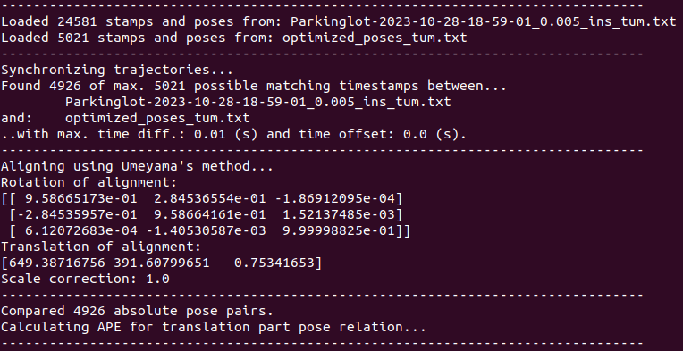
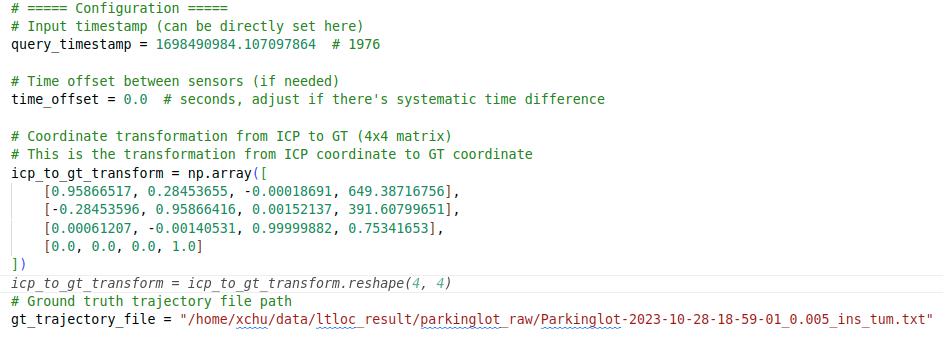
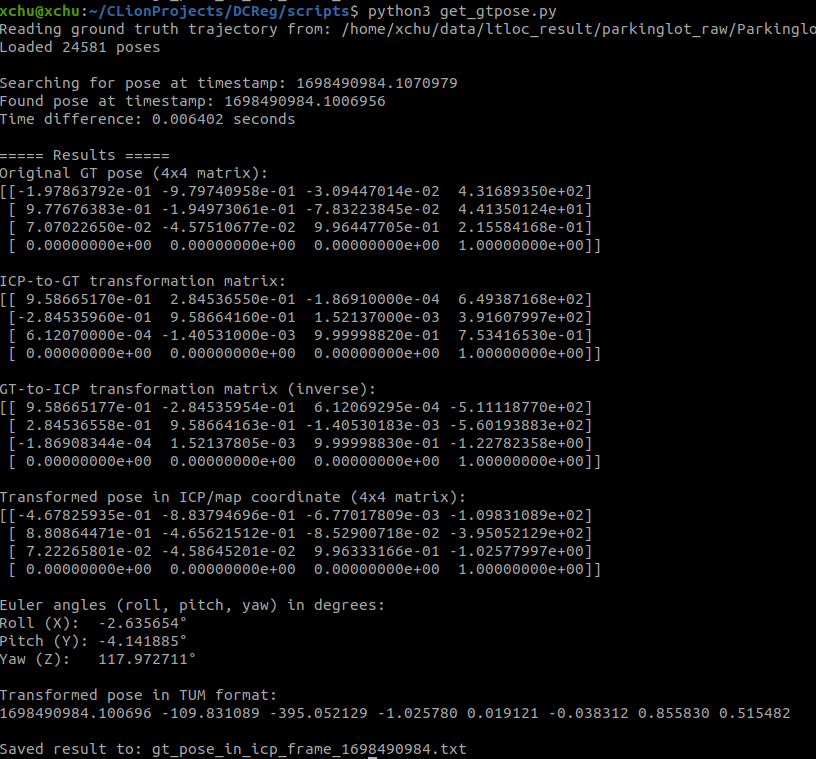
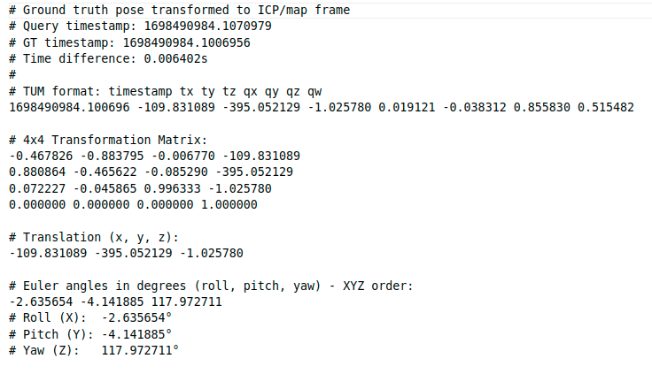

given timestamp, get the nearest gt pose from gt trajectory in tum.


1. use evo to get the transform matrix between your estimate trajectory and gt trajectory

```bash
evo_ape tum Parkinglot-2023-10-28-18-59-01_0.005_ins_tum.txt optimized_poses_tum.txt -va
```



2. set the target pose timestamps and the transform matrix



3. then we can get the corresponding gt pose for the estimated pose.





