

<h1>DCReg: Decoupled Characterization for Efficient Degenerate LiDAR Registration System</h1>

[**Xiangcheng Hu**](https://github.com/JokerJohn)1 · [**Xieyuanli Chen**](https://chen-xieyuanli.github.io/)2&dagger; · [**Mingkai Jia**](https://scholar.google.com/citations?user=fcpTdvcAAAAJ&hl=en)1 ·
[**Jin Wu**](https://zarathustr.github.io/) 3*
 
 [**Ping Tan**](https://facultyprofiles.hkust.edu.hk/profiles.php?profile=ping-tan-pingtan#publications)1 and  [**Steven L. Waslander**](https://www.trailab.utias.utoronto.ca/steven-waslander)4

1HKUST&emsp;&emsp;&emsp;2NUDT&emsp;&emsp;&emsp;3USTB &emsp;&emsp;&emsp;4U of T
 
&dagger;Project lead&emsp;*Corresponding author

 <a href="https://github.com/JokerJohn/DCReg/blob/main/">

In this study, we introduce **[DCReg](https://arxiv.org/abs/2509.06285)** (**D**ecoupled **C**haracterization for ill-conditioned **Reg**istration), a principled framework
that systematically addresses the ill-conditioned registration problems through three integrated innovations. 

- First, DCReg achieves **reliable ill-conditioning detection** by employing a Schur complement decomposition to the hessian matrix. This technique decouples the registration problem into clean rotational and translational subspaces, eliminating coupling effects that mask degeneracy patterns in conventional analyses. 
- Second, within these cleanly subspaces, we develop **quantitative characterization** techniques that establish explicit mappings between mathematical eigenspaces and physical motion directions, providing actionable insights about which specific motions lack constraints. 
- Finally, leveraging this clean subspace, we design a **targeted mitigation** strategy: a novel preconditioner that selectively stabilizes only the identified ill-conditioned directions while preserving all well-constrained information in observable space. This enables efficient and robust optimization via the Preconditioned Conjugate Gradient method with a single physical interpretable parameter. 

Extensive experiments demonstrate **DCReg** achieves **at least 20% - 50% improvement in localization accuracy and 5-100 times speedup** over state-of-the-art methods across diverse environments. 

## Timeline

**2025/09/09:** the preprint paper is [online](https://arxiv.org/abs/2509.06285), baseline codes will be published first!

## Methods

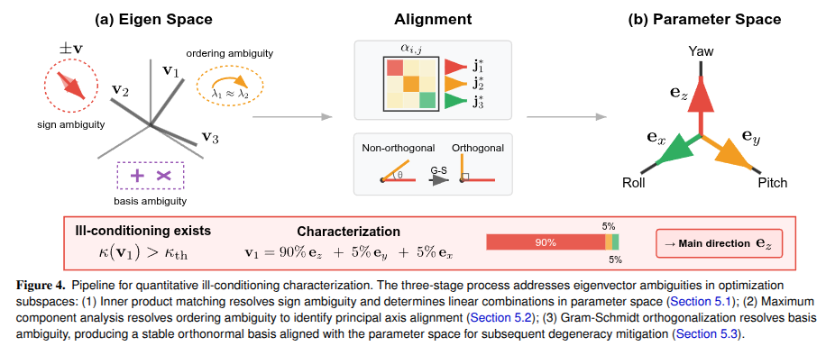

| 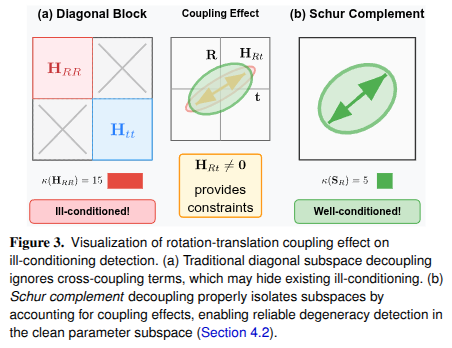 | 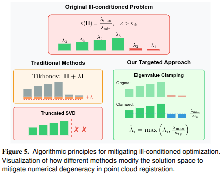 |
| ------------------------------------------------------------ | ------------------------------------------------------------ |

## Baseline and dataset

| 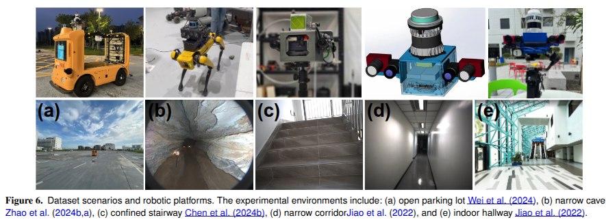 |
| ------------------------------------------------------------ |
| 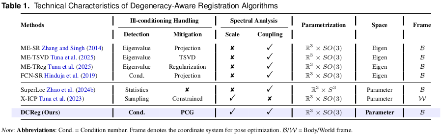 |

| 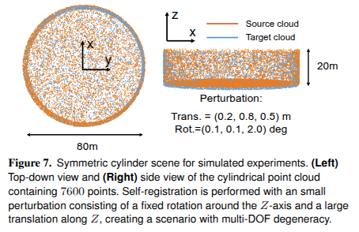 | 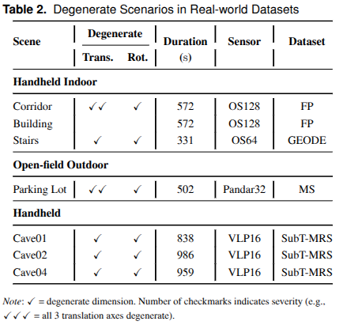 |
| ------------------------------------------------------------ | ------------------------------------------------------------ |

### Controlled Simulation Analysis

| 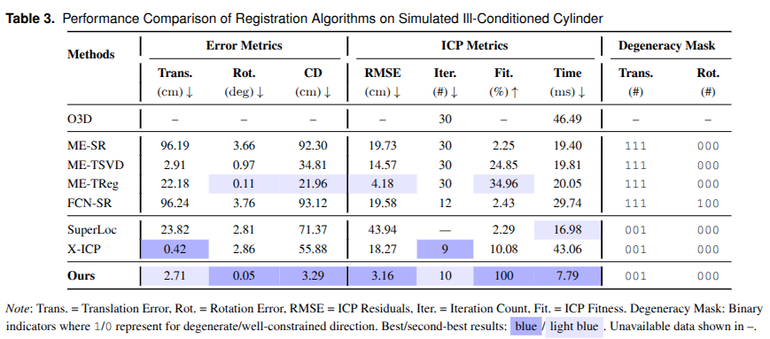 |
| ------------------------------------------------------------ |
| 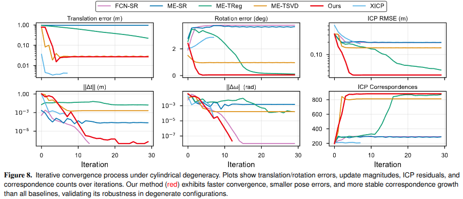 |

| 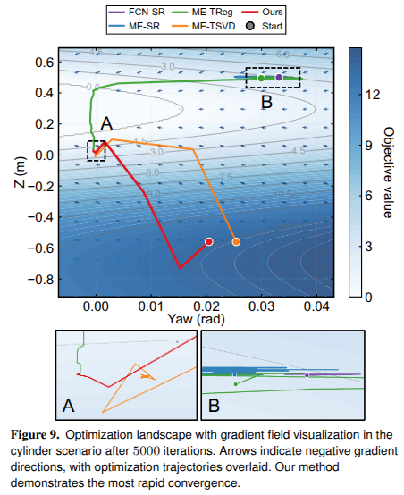 | 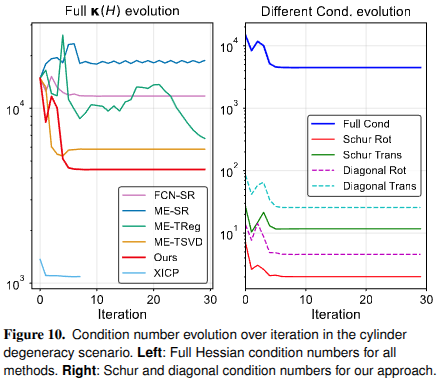 |
| ------------------------------------------------------------ | ------------------------------------------------------------ |

### Real-world Performance Evaluation

### localization and mapping

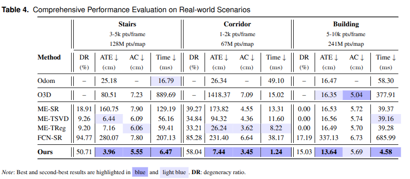

| 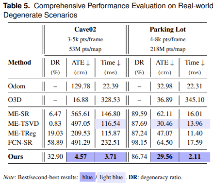 | 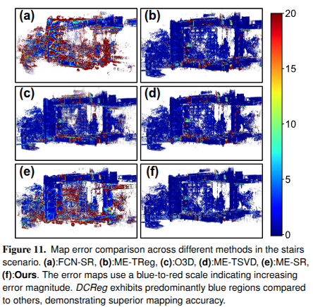 |
| ------------------------------------------------------------ | ------------------------------------------------------------ |

### Degeneracy Detection

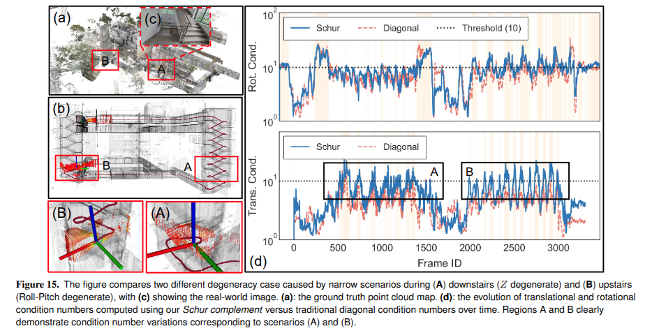

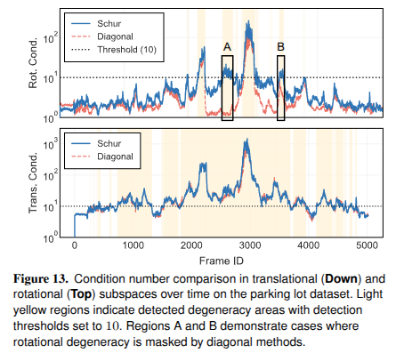 

| 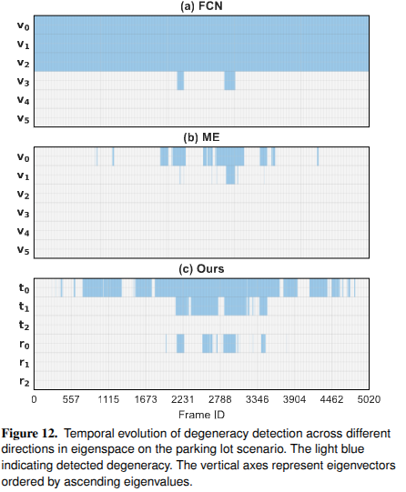 | 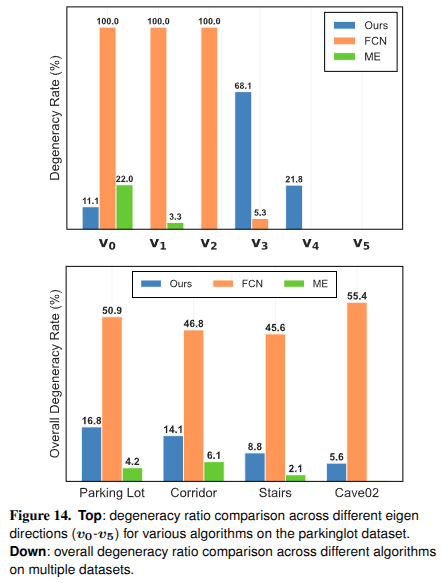 |
| ------------------------------------------------------------ | ------------------------------------------------------------ |

### Degeneracy Characterization

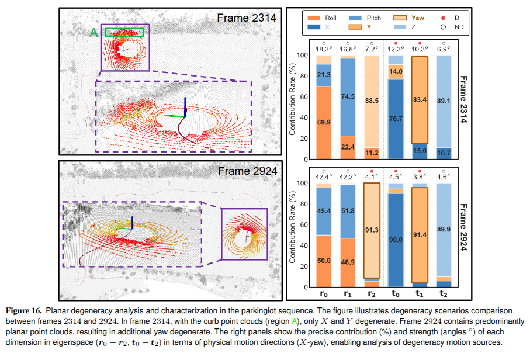

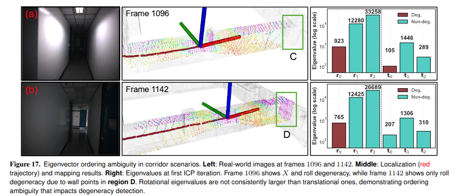

## Ablation and Hybrid Analysis

| 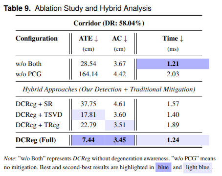 | 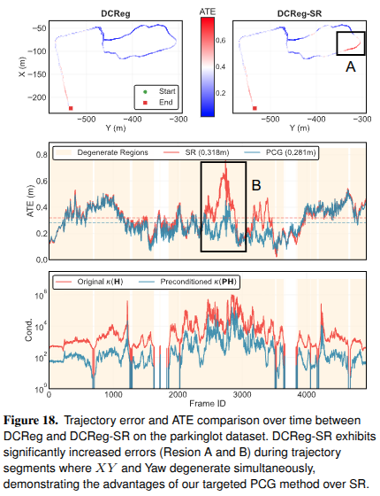 |
| ------------------------------------------------------------ | ------------------------------------------------------------ |

## Run-time analysis

| 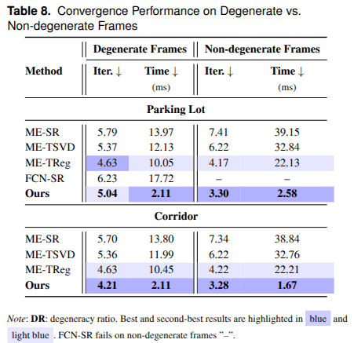 | 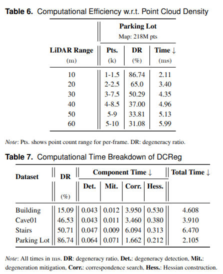 |
| ------------------------------------------------------------ | ------------------------------------------------------------ |

## Parameter 

## Acknowledgment

The authors gratefully acknowledge the valuable contributions that made this work possible. We extend special thanks to [Mr. Binqian Jiang](https://github.com/lewisjiang) and [Dr. Jianhao Jiao](https://gogojjh.github.io/) for their insightful discussions that significantly contributed to refining the theoretical framework presented in this paper. We also appreciate [Mr. Turcan Tuna](https://www.turcantuna.com/) for his technical assistance with the baseline algorithm implementation.

## Contributors

