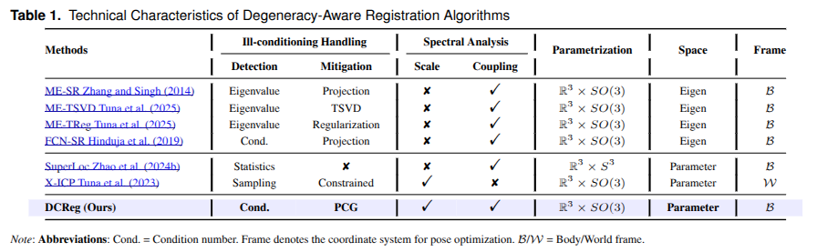

# DCReg

In this study, we introduce **DCReg** (**D**ecoupled **C**haracterization for ill-conditioned **Reg**istration), a principled framework
that systematically addresses the ill-conditioned registration problems through three integrated innovations. 

Extensive experiments demonstrate DCReg achieves at least 20% - 50% improvement in localization accuracy and 5-100 times speedup over state-of-the-art methods across diverse environments. Our implementation will be available at https://github.com/JokerJohn/DCReg. 

## Methods

|  |  |  |
| ------------------------------------------------------------ | ------------------------------------------------------------ | ------------------------------------------------------------ |

## Baseline and dataset

|  |  |
| ------------------------------------------------------------ | ------------------------------------------------------------ |

### Controlled Simulation Analysis

|  |
| ------------------------------------------------------------ |
|  |

|  |  |
| ------------------------------------------------------------ | ------------------------------------------------------------ |

### Real-world Performance Evaluation

### localization and mapping

|  |  |
| ------------------------------------------------------------ | ------------------------------------------------------------ |

### Degeneracy Detection

|  |  |
| ------------------------------------------------------------ | ------------------------------------------------------------ |

### Degeneracy Characterization

## Ablation and Hybrid Analysis

|  |  |
| ------------------------------------------------------------ | ------------------------------------------------------------ |

## Run-time analysis

|  |  |
| ------------------------------------------------------------ | ------------------------------------------------------------ |

## Parameter 

