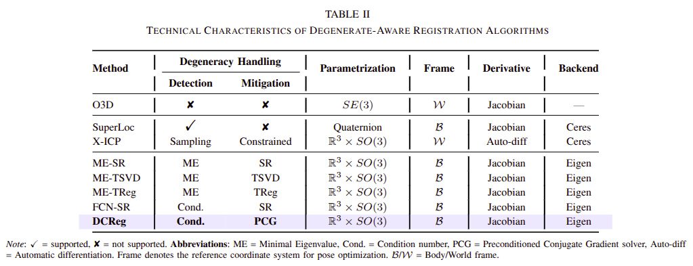
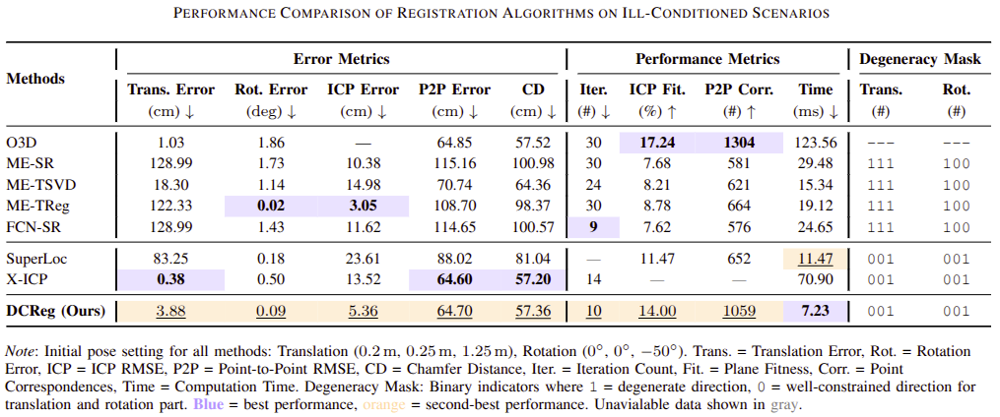
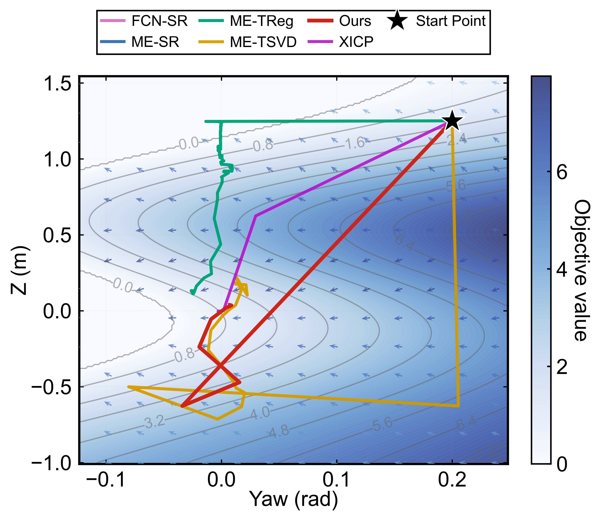

# DCReg

DCReg: Decoupled Characterization for Robust LiDAR Registration.

| FCN-SR                                   | ME-SR(LOAM)                              | ME-TReg                                  | ME-TSVD                                  | Ours                                     |
| ---------------------------------------- | ---------------------------------------- | ---------------------------------------- | ---------------------------------------- | ---------------------------------------- |
| .png) | .png) | .png) | .png) | .png) |

Different frame and parametrization definition will affect the convergence.  **Autodiff + NumericDiff** are not included in the origin codes of baseline methods.

