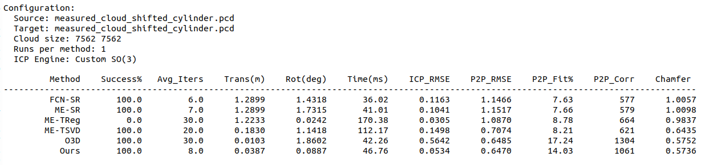
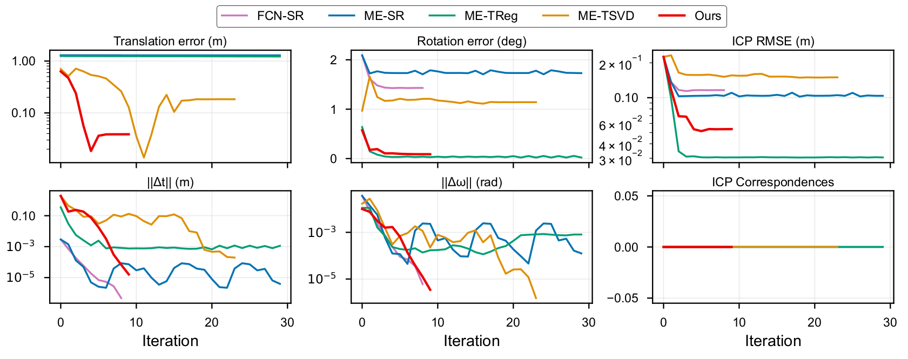
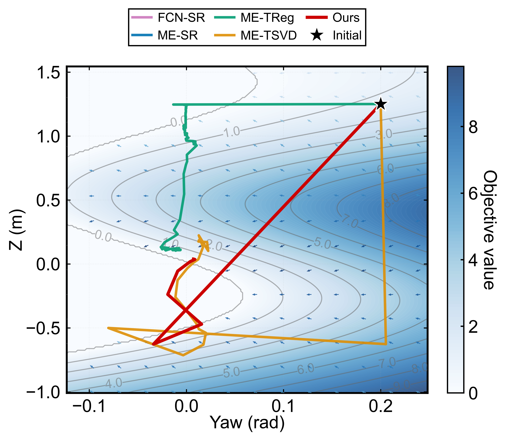

# DCReg

DCReg: Decoupled Characterization for Robust LiDAR Registration.

| FCN-SR                                   | ME-SR(LOAM)                              | ME-TReg                                  | ME-TSVD                                  | Ours                                     |
| ---------------------------------------- | ---------------------------------------- | ---------------------------------------- | ---------------------------------------- | ---------------------------------------- |
| .png) | .png) | .png) | .png) | .png) |

| Baseline Method                                      | Parametrization | Frame            | **Differentiation**                   | Lib   |
| ---------------------------------------------------- | --------------- | ---------------- | ------------------------------------- | ----- |
| [LOAM](https://github.com/laboshinl/loam_velodyne)   | Euler           | Body (右乘更新)  | Jacobian                              | Eigen |
| [ME-SR(LOAM)](https://github.com/JokerJohn/DCReg)    | R3 * SO(3)      | Body             | Jacobian                              | Eigen |
| [SuperLoc](https://github.com/JokerJohn/SuperOdom-M) | **Quaternions** | Body             | Jacobian + **Autodiff**               | Ceres |
| [X-ICP](https://github.com/JokerJohn/XICP-M)         | R3 *  SO(3)     | World (左乘更新) | Jacobian + **Autodiff + NumericDiff** | Ceres |
| [Open3D](https://github.com/isl-org/Open3D)          | SE(3)           | World            | Jacobian                              | Eigen |
| PCL ICP                                              | SE(3)           | World            | Jacobian                              | Eigen |
| Ours                                                 | R3 *  SO(3)     | Body             | Jacobian                              | Eigen |

Different frame and parametrization definition will affect the convergence.  **Autodiff + NumericDiff** are not included in the origin codes of baseline methods.

