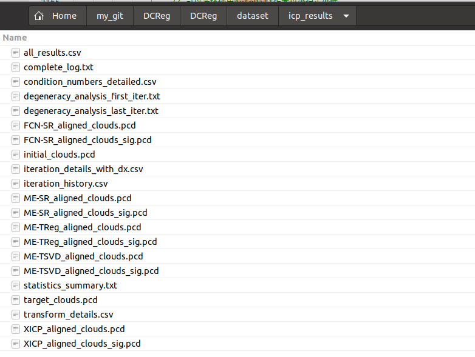
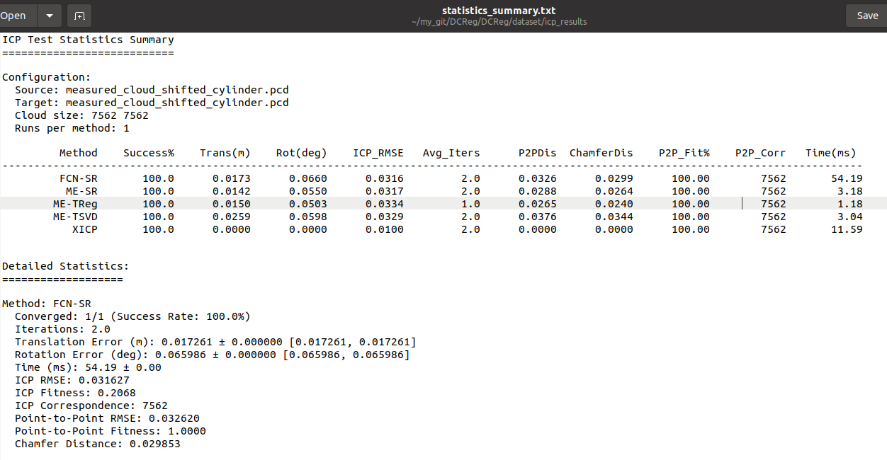

<div align="center">

# DCReg: Decoupled Characterization for Efficient Degenerate LiDAR Registration

[**Xiangcheng Hu**](https://github.com/JokerJohn)<sup>1</sup> · [**Xieyuanli Chen**](https://chen-xieyuanli.github.io/)<sup>2</sup> · [**Mingkai Jia**](https://scholar.google.com/citations?user=fcpTdvcAAAAJ&hl=en)<sup>1</sup> · [**Jin Wu**](https://zarathustr.github.io/)<sup>3*</sup>  
[**Ping Tan**](https://facultyprofiles.hkust.edu.hk/profiles.php?profile=ping-tan-pingtan#publications)<sup>1</sup> · [**Steven L. Waslander**](https://www.trailab.utias.utoronto.ca/steven-waslander)<sup>4&dagger;</sup>

<sup>1</sup>HKUST&emsp;<sup>2</sup>NUDT&emsp;<sup>3</sup>USTB&emsp;<sup>4</sup>University of Toronto  
&dagger;Project lead&emsp;*Corresponding author

<a href="https://arxiv.org/abs/2509.06285"></a>
[](https://www.bilibili.com/video/BV1jsHQzCEra/?share_source=copy_web)
[](https://github.com/JokerJohn/DCReg/stargazers)
[](https://github.com/JokerJohn/DCReg/issues)

[GitHub Wiki](https://github.com/JokerJohn/DCReg/wiki) | [English Wiki Source](./wiki/Home.md) | [中文 Wiki 源文档](./wiki/Home.zh-CN.md) | [Tabbed Web Docs](./docs/wiki/README.md)

</div>


**DCReg** (**D**ecoupled **C**haracterization for ill-conditioned **Reg**istration) is a Schur-complement-based framework for degenerate LiDAR registration. It detects weak observability in decoupled rotation and translation subspaces, maps the raw eigenspace into physical motion axes, and stabilizes only the degenerate directions through a targeted preconditioned solve.

This repository now exposes the **full public DCReg implementation on `main`**. The historical public snapshot that focused on baseline algorithms and released result files is preserved on the **`baseline`** branch.

## Highlights

- **Full DCReg release on `main`**: the Schur-based detection, physical-axis characterization, and preconditioned solver are now fully public.
- **Baseline preserved**: the previous public code snapshot is kept on the `baseline` branch for comparison and reproducibility.
- **Compact integration surface**: the current implementation is centered on [DCReg/include/dcreg.hpp](./DCReg/include/dcreg.hpp) and [DCReg/include/utils.hpp](./DCReg/include/utils.hpp).
- **Reduced dependency footprint**: `main` requires only `Eigen + PCL`, with optional `TBB/OpenMP`; `Ceres`, `yaml-cpp`, and `Open3D` are no longer required.
- **Two runnable entry points**: a full simulation runner and a minimal module-by-module characterization example.

## Release Status

| Branch | Scope | Typical Use |
| --- | --- | --- |
| `main` | Verified full DCReg implementation | Run DCReg, inspect characterization logs, integrate into SLAM |
| `baseline` | Historical public release | Reproduce the earlier baseline-oriented public snapshot |

Repository layout:

- [DCReg/](./DCReg): current C++ implementation on `main`
- [baseline/](./baseline): reference baseline projects and historical support code
- [results/](./results): published experiment artifacts and paper-facing result files
- [wiki/](./wiki): bilingual wiki Markdown source
- [docs/wiki/](./docs/wiki): GitHub-Pages-ready bilingual tabbed documentation page

## News

- **2026/04/21**: released the verified full DCReg code on `main`; preserved the previous public release on `baseline`; added a compact minimal example and repo-local default simulation input.
- **2025/09/23**: released baseline codes and data, including `ME-SR`, `ME-TSVD`, `ME-TReg`, `FCN-SR`, `O3D`, `XICP`, and `SuperLoc`.
- **2025/09/09**: paper preprint released on arXiv.

## Why DCReg

DCReg is built around three core modules:

1. **Spectral degeneracy detection**  
   Build Schur complements for rotation and translation and inspect their spectra.
2. **Physical-axis degeneracy characterization**  
   Align raw Schur eigenvectors to `roll/pitch/yaw` and `x/y/z`, then quantify contribution ratios and weak directions.
3. **Preconditioned linear solve**  
   Clamp only the weak eigenvalues and solve the resulting system with a targeted PCG update.

The current `main` branch exposes these three steps both in the full runner and in a minimal standalone example.

## Quick Start

### Dependencies

Tested on Ubuntu 20.04 with C++17.

#### `main`

| Required | Optional |
| --- | --- |
| Eigen3 | TBB |
| PCL | OpenMP |

#### `baseline`

The historical `baseline` branch follows the earlier release and still depends on the older stack, including `Open3D`, `Ceres`, and `yaml-cpp`.

### Build

```bash
cd DCReg
mkdir -p build
cd build
cmake ..
cmake --build . -j8
```

This builds:

- `dcreg_runner`: full simulation runner with `Algorithm::kNone` and `Algorithm::kDCReg`
- `dcreg_minimal_example`: compact module-by-module DCReg example

### Run

```bash
cd DCReg/build
./dcreg_minimal_example
./dcreg_runner
```

The default simulation input on `main` is repo-local:

- [DCReg/dataset/shifted_cylinder/measured_cloud_shifted_cylinder.pcd](./DCReg/dataset/shifted_cylinder/measured_cloud_shifted_cylinder.pcd)

The real-world parking-lot case is still present in code, but it expects your local dataset path. Edit [DCReg/include/utils.hpp](./DCReg/include/utils.hpp) if you want to run that case.

## Output And Logs

The old release already exposed ICP result summaries and point-cloud outputs. Those result assets remain in the repository, while `main` additionally exposes a minimal log that mirrors the three DCReg modules.

| Output Files | Summary Files |
| --- | --- |
|  |  |

### Example Log From `dcreg_minimal_example`

```text
Synthetic DCReg example
[Module 1] Spectral degeneracy detection
cond_full: 1122.345689
cond_schur_rot: 36.087707
cond_schur_trans: 742.066396

[Module 2] Physical-axis degeneracy characterization
degenerate_mask: 001001
raw_lambda_rot:  1.001796 19.881966 36.152505
raw_lambda_trans:  0.032394 12.252030 24.038714
aligned_lambda_rpy: 36.152505 19.881966  1.001796
aligned_lambda_xyz: 24.038714 12.252030  0.032394
rot_axis_contribution_ratio(rows=rpy, cols=aligned_rpy):
                      mode_r      mode_p      mode_y
roll                0.995659    0.000004    0.004337
pitch               0.000001    0.999791    0.000208
yaw                 0.004340    0.000205    0.995456
trans_axis_contribution_ratio(rows=xyz, cols=aligned_xyz):
                      mode_x      mode_y      mode_z
x                   0.999989    0.000000    0.000011
y                   0.000000    0.999834    0.000166
z                   0.000011    0.000166    0.999823
clamped_lambda_rpy: 36.152505 19.881966  3.615250
clamped_lambda_xyz: 24.038714 12.252030  2.403871

[Module 3] Preconditioned linear solve
preconditioned_delta:  0.190398 -0.306306 -2.620922  0.095321 -0.515479 41.997563
pcg_iterations: 6
pcg_relative_residual: 0.000000
qr_fallback: 0
```

## Verified Simulation Result On `main`

The default `shifted_cylinder` case was re-validated after the full-release sync:

| Parameterization | Iter | RMSE | Fitness | Translation Error (m) | Rotation Error (deg) | LinIt | QRfb |
| --- | ---: | ---: | ---: | ---: | ---: | ---: | ---: |
| Euler | 9 | 0.0314988 | 0.116239 | 0.0258485 | 0.0516469 | 6 | 0 |
| SE3 | 10 | 0.0315708 | 0.116636 | 0.0271197 | 0.0507196 | 6 | 0 |
| SO3 | 10 | 0.0315708 | 0.116636 | 0.0271196 | 0.0507195 | 6 | 0 |
| Quaternion | 10 | 0.0315708 | 0.116636 | 0.0271196 | 0.0507195 | 6 | 0 |

## Method Overview


| Schur-Based Detection | Physical-Axis Mapping |
| --- | --- |
|  |  |

## Baselines And Dataset

The previous release already shipped the baseline ecosystem and dataset/result folders. These are still retained in this repository and now coexist with the full DCReg implementation.

| Baseline Release Overview |
| --- |
|  |

| Dataset And Outputs | Branch/Release Context |
| --- | --- |
|  |  |

### Test Data

The original simulation and parking-lot test data link remains:

- [Cylinder and Parking-lot frames](https://drive.google.com/drive/folders/1TnS7K7q0hr-7SY__mR8pGQX1PJV3Bzfo?usp=drive_link)

## Video Demo


| Scenario | Characterization Example | Interpretation |
| --- | --- | --- |
|  |  | Planar degeneracy with dominant weak directions in `X-Y-Yaw`; see Fig. 16 in the paper. |
|  |  | Sparse geometry in narrow stairs; weak directions move between `t2` and `r0-r1`; see Fig. 17. |
|  |  | Narrow-passage degeneracy, typically `r0-t0` or `r0` depending on the measurements. |
|  |  | Rich local points inside a geometrically narrow environment, often yielding `r0-t0` or `r0`. |

## Experimental Results

### Controlled Simulation Analysis

| Overview |
| --- |
|  |
|  |

| Error Trend | Convergence Trend |
| --- | --- |
|  |  |

### Real-World Performance Evaluation

#### Localization And Mapping


| Localization | Mapping |
| --- | --- |
|  |  |

#### Degeneracy Characterization

| Characterization |
| --- |
|  |
|  |

#### Degeneracy Detection


<div align="center">
  
</div>

| Detection Case A | Detection Case B |
| --- | --- |
|  |  |

### Ablation And Hybrid Analysis

| Ablation | Hybrid Analysis |
| --- | --- |
|  |  |

### Run-Time Analysis

| Runtime | Runtime Detail |
| --- | --- |
|  |  |

### Parameter Study

<div align="center">
  
</div>

## Technical Insights

### Schur Conditioning

| Figure | Interpretation |
| --- | --- |
|  | `S_R` is the Hessian of the rotation subproblem after optimally accommodating translation, so its spectrum reflects rotation observability without translation-scale contamination. |
|  | The Schur projection removes the component of `range(J_R)` that can be explained by `J_t`, preserving only irreducible rotation information. |
|  | This explains why Schur complements naturally reduce sensitivity to unit/scale disparities between radians and meters. |
|  | `kappa(S_R)` can differ substantially from `kappa(H_RR)` when cross-coupling is strong, which is exactly why coupled weak directions must be separated before analysis. |

### Eigenvalue Clamping In Subspace

| Figure | Interpretation |
| --- | --- |
|   | DCReg clamps only the weak eigenvalues in the decoupled subspace instead of blindly overwriting the full coupled Hessian. |
|   | The same operation can be interpreted as targeted regularization confined to the weak directions. |

## FAQ

### What changed from the old public release?

The old public release emphasized the baseline ecosystem and historical result files. The current `main` branch now includes the verified DCReg algorithm itself, the lightweight characterization example, and the reduced-dependency build path.

### Where should I start if I want to integrate DCReg into another SLAM system?

Start from:

- [DCReg/include/dcreg.hpp](./DCReg/include/dcreg.hpp)
- [DCReg/include/utils.hpp](./DCReg/include/utils.hpp)
- [DCReg/src/dcreg_minimal_example.cpp](./DCReg/src/dcreg_minimal_example.cpp)

The minimal example mirrors the three algorithmic modules and is the cleanest entry point for integration.

### What do I get from the historical baseline branch?

The `baseline` branch still exposes:

- different pose parameterizations for ICP, such as `SE(3)`, `SO(3)+R^3`, quaternion, and Euler
- different optimization implementations, such as manual Eigen solvers and older Ceres-based paths
- different parallel backends, including OpenMP and TBB

## Documentation

This repository now contains two complementary documentation layers:

- [GitHub Wiki](https://github.com/JokerJohn/DCReg/wiki): synchronized bilingual wiki pages for algorithm details, installation, and experiment results
- [wiki/](./wiki): in-repo bilingual Markdown source for the wiki content
- [docs/wiki/](./docs/wiki/README.md): GitHub-Pages-ready bilingual documentation with a tabbed HTML page

The GitHub Wiki now mirrors the core bilingual pages. The tabbed HTML page remains in `docs/wiki/` because it is better suited to a polished web-doc view than the standard GitHub Wiki renderer.

## Citation

```bibtex
@misc{hu2025dcreg,
  title={DCReg: Decoupled Characterization for Efficient Degenerate LiDAR Registration},
  author={Xiangcheng Hu and Xieyuanli Chen and Mingkai Jia and Jin Wu and Ping Tan and Steven L. Waslander},
  year={2025},
  eprint={2509.06285},
  archivePrefix={arXiv},
  primaryClass={cs.RO},
  url={https://arxiv.org/abs/2509.06285}
}
```

## Acknowledgment

The authors gratefully acknowledge the valuable contributions that made this work possible.

- We extend special thanks to [Dr. Binqian Jiang](https://github.com/lewisjiang) and [Dr. Jianhao Jiao](https://gogojjh.github.io/) for their insightful discussions that helped refine the theoretical framework presented in this work.
- We also appreciate [Mr. Turcan Tuna](https://www.turcantuna.com/) for his technical assistance with the baseline XICP implementation.

## Contributors

<a href="https://github.com/JokerJohn/DCReg/graphs/contributors">
  
</a>
