<div align="center">

# DCReg: Decoupled Characterization for Efficient Degenerate LiDAR Registration

[**Xiangcheng Hu**](https://github.com/JokerJohn)<sup>1</sup> · [**Xieyuanli Chen**](https://chen-xieyuanli.github.io/)<sup>2</sup> · [**Mingkai Jia**](https://scholar.google.com/citations?user=fcpTdvcAAAAJ&hl=en)<sup>1</sup> · [**Jin Wu**](https://zarathustr.github.io/)<sup>3*</sup>  
[**Ping Tan**](https://facultyprofiles.hkust.edu.hk/profiles.php?profile=ping-tan-pingtan#publications)<sup>1</sup> · [**Steven L. Waslander**](https://www.trailab.utias.utoronto.ca/steven-waslander)<sup>4&dagger;</sup>

<sup>1</sup>HKUST&emsp;<sup>2</sup>NUDT&emsp;<sup>3</sup>USTB&emsp;<sup>4</sup>University of Toronto  
&dagger;Project lead&emsp;*Corresponding author

<a href="https://arxiv.org/abs/2509.06285"></a>
[](https://www.bilibili.com/video/BV1jsHQzCEra/?share_source=copy_web)
[](https://github.com/JokerJohn/DCReg/stargazers)
[](https://github.com/JokerJohn/DCReg/issues)

[GitHub Wiki](https://github.com/JokerJohn/DCReg/wiki)

</div>

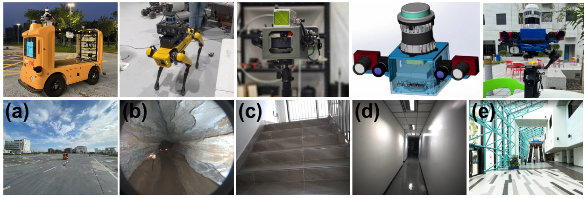

**DCReg** (**D**ecoupled **C**haracterization for ill-conditioned **Reg**istration) is a principled framework for degenerate LiDAR registration. It decouples rotation and translation observability with Schur complements, maps eigenspaces into physical motion axes, and stabilizes only the weak directions through targeted preconditioning.

The `main` branch now contains the **full public DCReg implementation**. The earlier baseline-only public snapshot remains available on the separate **`baseline`** branch.

## Highlights

- Schur-complement-based spectral degeneracy detection that removes misleading rotation-translation coupling before observability analysis.
- Physical-axis characterization that maps weak modes to `roll/pitch/yaw` and `x/y/z`, with aligned eigenvalues and contribution ratios.
- Targeted preconditioning that stabilizes only the weak directions instead of damping the full coupled system.
- Lightweight runtime stack: `Eigen + PCL`, with optional `TBB/OpenMP`.

## News And Timeline

- **2026/04/21**: released the verified full DCReg implementation on `main`.
- **2026/03/31**: updated the second arXiv version and corrected the theoretical issue in the structured preconditioner analysis.
- **2026/03/12**: received a **Conditional Acceptance** and started the final clarification and revision cycle.
- **2025/10/30**: completed a **Major Revision** focused on clarifying the logic and presentation of the paper.
- **2025/09/23**: released baseline codes and data, including `ME-SR`, `ME-TSVD`, `ME-TReg`, `FCN-SR`, `O3D`, `XICP`, and `SuperLoc`.
- **2025/09/09**: released the preprint on [arXiv](https://arxiv.org/abs/2509.06285).

## Next Up

- Open-source a DCReg-based localization system to show how the method can be integrated into larger pipelines and adapted across different algorithms.

## Quick Start

### Dependencies

Tested on Ubuntu 20.04 with C++17.

| Category | Packages |
| --- | --- |
| Required | Eigen3, PCL |
| Optional | TBB, OpenMP |
| Not required by C++ core | Ceres, `yaml-cpp`, Open3D |

### Build

From the repository root:

```bash
cmake -S DCReg -B DCReg/build
cmake --build DCReg/build -j8
```

### Run

```bash
./DCReg/build/dcreg_minimal_example
./DCReg/build/dcreg_runner
```

### Real-Scene Parking-Lot Demo

The repository also includes a compact real-scene runner:

```bash
cmake --build DCReg/build -j8 --target dcreg_parking_lot_example
./DCReg/build/dcreg_parking_lot_example
```

This runner keeps the core DCReg dependency surface unchanged: the C++ code
still depends only on `Eigen + PCL` with optional `TBB/OpenMP`. The optional
Open3D visualizer is a separate Python script:

```bash
python3 -m pip install open3d numpy pillow
python3 scripts/visualize_parking_lot_example.py
```

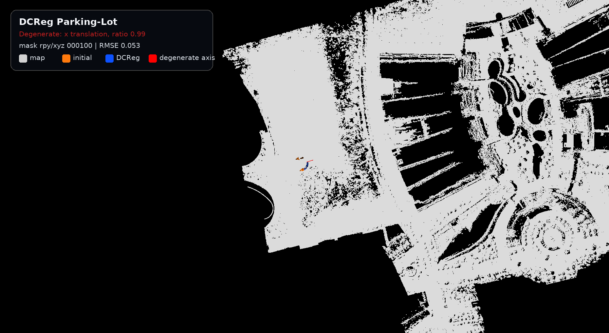

The visualization uses a black background, intensity-colored point clouds, a
compact diagnostic card, and the detected weak/degenerate physical axes.
For readability, the exported target map is a `100 m` local crop of the prior
map around the final pose, downsampled at `0.5 m` while preserving intensity.
In the bundled `pk01-1976` frame, the current run converges in 5 iterations
from the provided prior pose and characterizes the weakest translational
direction along the physical `x` axis.

### Bundled Sample Data

Small demo inputs are bundled under `DCReg/data/` so the synthetic runner and
parking-lot source frame are easy to inspect. The complete data package,
including the large parking-lot prior map, is provided externally:

- [Cylinder and parking-lot frames](https://drive.google.com/drive/folders/1TnS7K7q0hr-7SY__mR8pGQX1PJV3Bzfo?usp=drive_link)

For the parking-lot demo, download `prior_map.pcd` from that link and place it
as:

```text
DCReg/data/Parking-Lot-example/prior_map.pcd
```

### What The Executables Are For

- `dcreg_minimal_example`: prints the three core DCReg modules and is the cleanest entry point for integrating the solver into another SLAM system.
- `dcreg_runner`: runs the verified synthetic registration pipeline and compares four parameterizations under the same implementation.
- `dcreg_parking_lot_example`: runs a real parking-lot single-frame-to-map registration case and exports visualization artifacts.

### Representative Minimal-Example Log

```text
Synthetic DCReg example
[Module 1] Spectral degeneracy detection
cond_full: 1122.345689
cond_schur_rot: 36.087707
cond_schur_trans: 742.066396

[Module 2] Physical-axis degeneracy characterization
degenerate_mask: 001001
raw_lambda_rot:  1.001796 19.881966 36.152505
raw_lambda_trans:  0.032394 12.252030 24.038714
aligned_lambda_rpy: 36.152505 19.881966  1.001796
aligned_lambda_xyz: 24.038714 12.252030  0.032394
rot_axis_contribution_ratio(rows=rpy, cols=aligned_rpy):
                      mode_r      mode_p      mode_y
roll                0.995659    0.000004    0.004337
pitch               0.000001    0.999791    0.000208
yaw                 0.004340    0.000205    0.995456
trans_axis_contribution_ratio(rows=xyz, cols=aligned_xyz):
                      mode_x      mode_y      mode_z
x                   0.999989    0.000000    0.000011
y                   0.000000    0.999834    0.000166
z                   0.000011    0.000166    0.999823
clamped_lambda_rpy: 36.152505 19.881966  3.615250
clamped_lambda_xyz: 24.038714 12.252030  2.403871

[Module 3] Preconditioned linear solve
preconditioned_delta:  0.190398 -0.306306 -2.620922  0.095321 -0.515479 41.997563
pcg_iterations: 6
pcg_relative_residual: 0.000000
qr_fallback: 0
```

## Method Overview


DCReg is organized around three core modules:

1. **Spectral degeneracy detection**  
   Build Schur complements for rotation and translation and inspect their spectra.
2. **Physical-axis degeneracy characterization**  
   Align raw Schur eigenvectors to `roll/pitch/yaw` and `x/y/z`, then quantify contribution ratios and weak directions.
3. **Preconditioned linear solve**  
   Clamp only the weak aligned eigenvalues and solve the normal equation with a targeted PCG update.

| Schur-Based Detection | Physical-Axis Mapping |
| --- | --- |
| 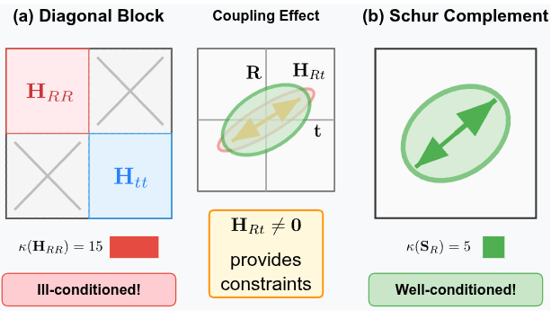 | 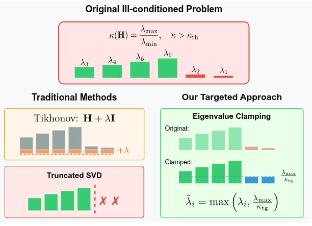 |

## Verified Results On `main`

The default `shifted_cylinder` case was re-validated after the full public release sync:

| Parameterization | Iter | RMSE | Fitness | Translation Error (m) | Rotation Error (deg) | LinIt | QRfb |
| --- | ---: | ---: | ---: | ---: | ---: | ---: | ---: |
| Euler | 9 | 0.0314988 | 0.116239 | 0.0258485 | 0.0516469 | 6 | 0 |
| SE3 | 10 | 0.0315708 | 0.116636 | 0.0271197 | 0.0507196 | 6 | 0 |
| SO3 | 10 | 0.0315708 | 0.116636 | 0.0271196 | 0.0507195 | 6 | 0 |
| Quaternion | 10 | 0.0315708 | 0.116636 | 0.0271196 | 0.0507195 | 6 | 0 |

## Legacy Release Context

The earlier baseline-oriented public release remains available on the separate `baseline` branch.

| Baseline Release Overview |
| --- |
|  |

| Dataset Context | Release Context |
| --- | --- |
|  |  |

## Video Demo


| Scenario | Characterization Example | Interpretation |
| --- | --- | --- |
| 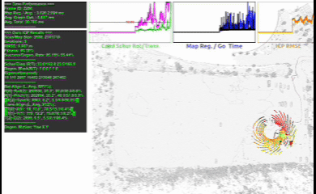 | 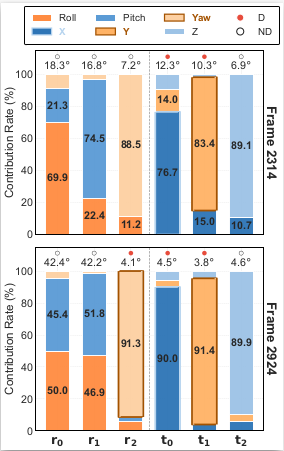 | Planar degeneracy with dominant weak directions in `X-Y-Yaw`; see Fig. 16 in the paper. |
|  |  | Sparse geometry in narrow stairs; weak directions move between `t2` and `r0-r1`; see Fig. 17 in the paper. |
| 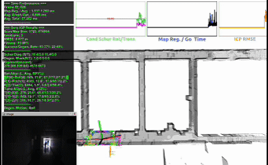 | 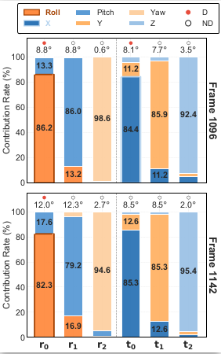 | Narrow-passage degeneracy, typically `r0-t0` or `r0` depending on the measurements. |
|  |  | Rich local structure inside geometrically narrow environments, often yielding `r0-t0` or `r0`. |

## Experimental Results

### Controlled Simulation Analysis

| Overview |
| --- |
| 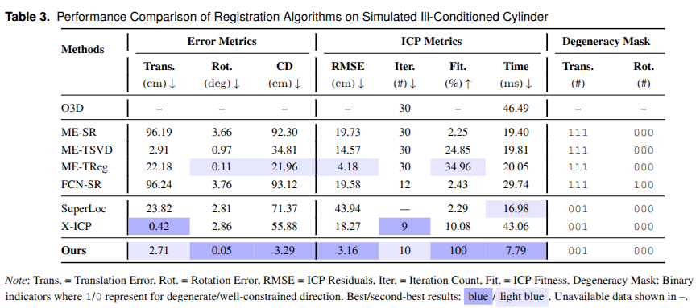 |
| 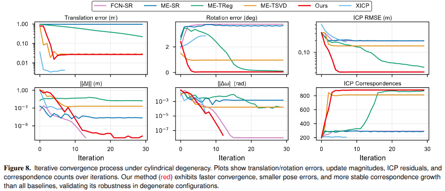 |

| Error Trend | Convergence Trend |
| --- | --- |
| 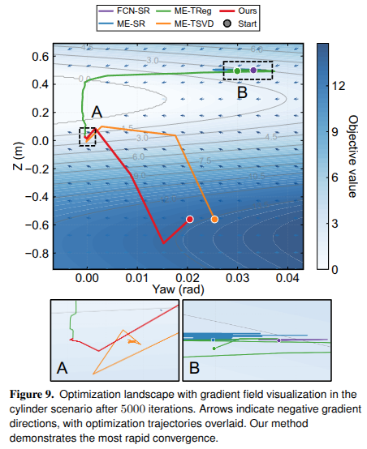 | 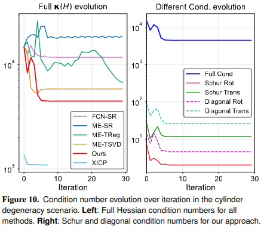 |

### Real-World Performance Evaluation

#### Localization And Mapping

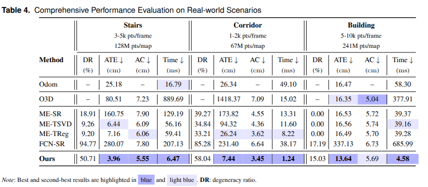

| Localization | Mapping |
| --- | --- |
| 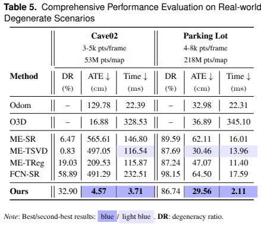 |  |

#### Degeneracy Characterization

| Characterization |
| --- |
|  |
| 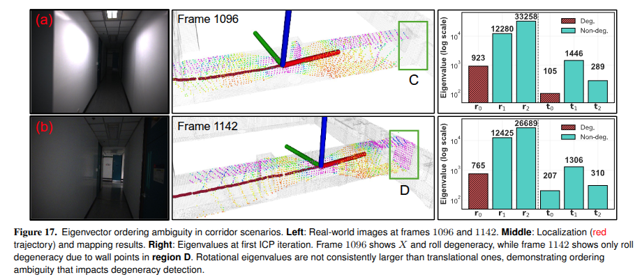 |

#### Degeneracy Detection

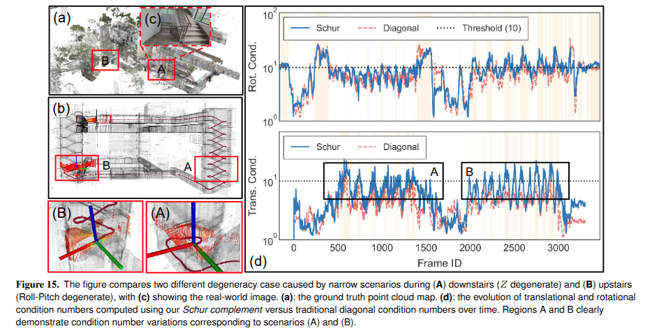

<div align="center">
  
</div>

| Detection Case A | Detection Case B |
| --- | --- |
|  | 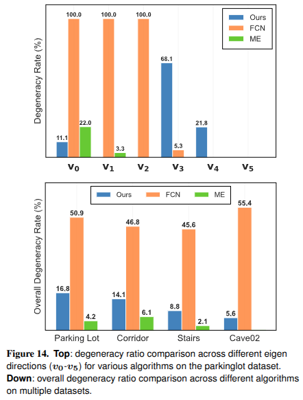 |

### Ablation And Hybrid Analysis

| Ablation | Hybrid Analysis |
| --- | --- |
|  |  |

### Runtime Analysis

| Runtime | Runtime Detail |
| --- | --- |
| 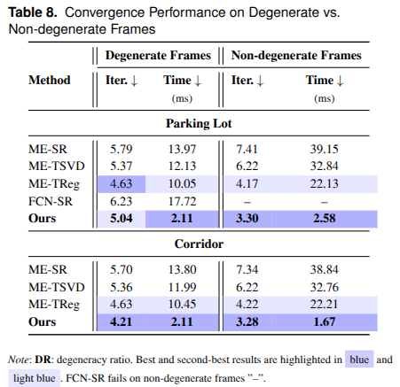 |  |

### Parameter Study

<div align="center">
  
</div>

## Technical Notes

### Schur Conditioning

| Figure | Interpretation |
| --- | --- |
| 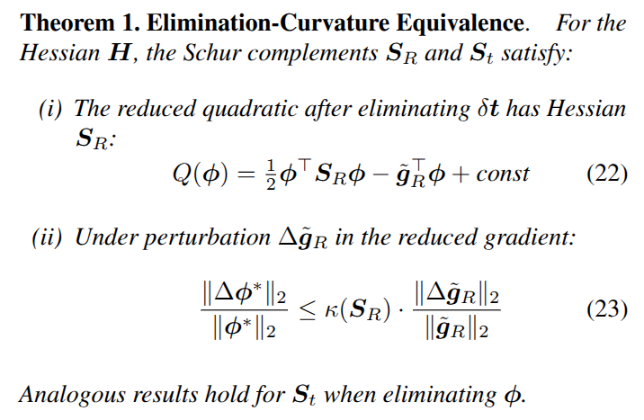 | `S_R` is the Hessian of the rotation subproblem after optimally accommodating translation, so its spectrum reflects rotation observability without translation-scale contamination. |
|  | The Schur projection removes the component of `range(J_R)` that can be explained by `J_t`, preserving only irreducible rotation information. |
| 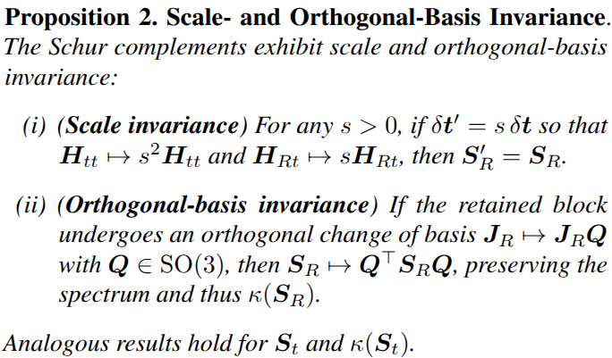 | This explains why Schur complements naturally reduce sensitivity to unit and scale disparities between radians and meters. |
|  | `kappa(S_R)` can differ substantially from `kappa(H_RR)` when cross-coupling is strong, which is exactly why coupled weak directions should be analyzed after decoupling. |

### Eigenvalue Clamping In Subspace

| Figure | Interpretation |
| --- | --- |
|  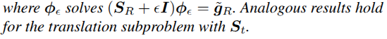 | DCReg clamps only the weak eigenvalues in the decoupled subspace instead of overwriting the full coupled Hessian. |
| 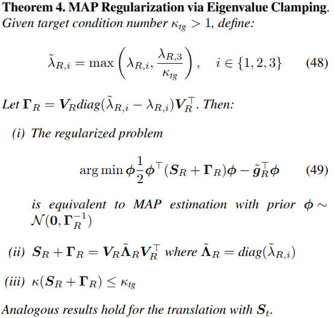  | The same operation can also be interpreted as targeted regularization confined to the weak directions. |

## Documentation

Public-facing documentation lives on the [GitHub Wiki](https://github.com/JokerJohn/DCReg/wiki).

## Citation

```bibtex
@misc{hu2025dcreg,
  title={DCReg: Decoupled Characterization for Efficient Degenerate LiDAR Registration},
  author={Xiangcheng Hu and Xieyuanli Chen and Mingkai Jia and Jin Wu and Ping Tan and Steven L. Waslander},
  year={2025},
  eprint={2509.06285},
  archivePrefix={arXiv},
  primaryClass={cs.RO},
  url={https://arxiv.org/abs/2509.06285}
}
```

## Acknowledgment

The authors gratefully acknowledge the valuable contributions that made this work possible.

- We extend special thanks to [Dr. Binqian Jiang](https://github.com/lewisjiang) and [Dr. Jianhao Jiao](https://gogojjh.github.io/) for their insightful discussions that helped refine the theoretical framework of this work.
- We also appreciate [Mr. Turcan Tuna](https://www.turcantuna.com/) for his technical assistance with the baseline XICP implementation.

## Contributors

<a href="https://github.com/JokerJohn/DCReg/graphs/contributors">
  
</a>
