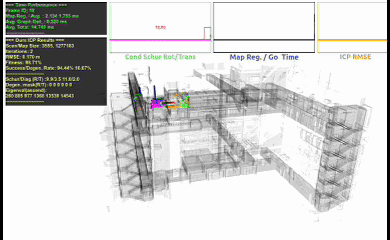
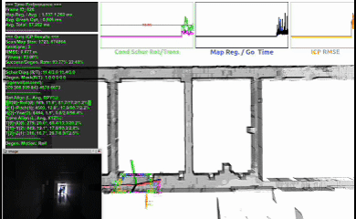

<div align="center">

<h1>DCReg: Decoupled Characterization for Efficient Degenerate LiDAR Registration</h1>

[**Xiangcheng Hu**](https://github.com/JokerJohn)<sup>1</sup> · [**Xieyuanli Chen**](https://chen-xieyuanli.github.io/)<sup>2</sup> · [**Mingkai Jia**](https://scholar.google.com/citations?user=fcpTdvcAAAAJ&hl=en)<sup>1</sup> ·
[**Jin Wu**](https://zarathustr.github.io/) <sup>3*</sup>
<br>
 [**Ping Tan**](https://facultyprofiles.hkust.edu.hk/profiles.php?profile=ping-tan-pingtan#publications)<sup>1</sup>· [**Steven L. Waslander**](https://www.trailab.utias.utoronto.ca/steven-waslander)<sup>4&dagger;</sup>

<sup>1</sup>HKUST&emsp;&emsp;&emsp;<sup>2</sup>NUDT&emsp;&emsp;&emsp;<sup>3</sup>USTB &emsp;&emsp;&emsp;<sup>4</sup>U of T
<br>
&dagger;Project lead&emsp;*Corresponding author

<a href="https://arxiv.org/abs/2509.06285"></a>[]( https://www.bilibili.com/video/BV1jsHQzCEra/?share_source=copy_web)[](https://github.com/JokerJohn/DCReg/stargazers) [](https://github.com/JokerJohn/DCReg/issues)

</div>


**[DCReg](https://arxiv.org/abs/2509.06285)** (**D**ecoupled **C**haracterization for ill-conditioned **Reg**istration) is a principled framework that addresses ill-conditioned point cloud registration problems, achieving **20% - 50% accuracy improvement and 5-100 times** speedup over state-of-the-art methods.

- **Reliable ill-conditioning detection**: Decouples rotation and translation via Schur complement decomposition for ill-conditioning detection，eliminating coupling effects that mask degeneracy patterns.
- **Quantitative characterization**: Maps mathematical eigenspace to physical motion space, revealing which and to what extent specific motions lack constraints
- **Targeted mitigation**: Employs targeted preconditioning that stabilizes only degenerate directions while preserving observable information.

DCReg seamlessly integrates with existing registration pipelines through an efficient PCG solver with a single interpretable parameter.


## Timeline

**2025/09/23:** the baseline codes and data released, including **ME-SR/ME-TSVD/ME-TReg/FCN-SR/O3D/XICP/SuperLoc**!! This codes will help you deeply into the ICP process.

**2025/09/09:** the preprint paper is [online](https://arxiv.org/abs/2509.06285), baseline codes will be published first!


## Quick Start

### Dependency (Test on Unbuntu 20.04)

| [Open3D 0.15.1](https://github.com/isl-org/Open3D/tree/v0.15.1) | [Ceres 2.1.0](https://github.com/ceres-solver/ceres-solver/tree/2.1.0) | [yaml-cpp 0.6.2](https://github.com/jbeder/yaml-cpp/tree/yaml-cpp-0.6.2) | [Eigen 3.3.7](https://gitlab.com/libeigen/eigen/-/releases/3.3.7) | OpenMP 201511 | TBB  2020.1 | PCL 1.10.0 |
| ------------------------------------------------------------ | ------------------------------------------------------------ | ------------------------------------------------------------ | ------------------------------------------------------------ | ------------- | ----------- | ---------- |

### Install

```bash
mkdir build
cd build
cmake ..
make -j8
```

set the file path and parametes in `icp.yaml`, but if you want to do iterative experments, e.g. iterative for 5000, just use the `icp_iter.yaml`. if you want to test on the real-world data, just use the `icp_pk01.yaml`, like **Figure.16** in the paper.

```bash
./icp_test_runner
```

For other settings, you can see the notes in the yaml. Note that, the impelment of SuperLoc and XICP has also verified using autodiff or NumericDiff methods. Finally you can get the output:

| output files                                                 | results summary                                              |
| ------------------------------------------------------------ | ------------------------------------------------------------ |
|  |  |

If you want to plot the statistics results like the figures in our papers, we will provide later. **If you want to integrate theses methods in your SLAM system, just make sure the degenercy handling only in the first iteration.**

### Test data: [Cylinder and Parkinglot frames](https://drive.google.com/drive/folders/1TnS7K7q0hr-7SY__mR8pGQX1PJV3Bzfo?usp=drive_link).

## Methods


|  |  |
| ------------------------------------------------------------ | ------------------------------------------------------------ |


## Baseline and dataset

|  |
| ------------------------------------------------------------ |

|  |  |
| ------------------------------------------------------------ | ------------------------------------------------------------ |


## Video demo


| Scenarios                                                    | Characterization Example                                     | Features                                                     |
| ------------------------------------------------------------ | ------------------------------------------------------------ | ------------------------------------------------------------ |
|  |  | <span style="font-size:12px;">Planar degeneracy, <br/>**t0-t1-r2** degenerate,<br/> the main <br/>components<br/> of motion <br/>sources are <br/> **X-Y-Yaw**. e.g.<br/> t0 = 90.0% X <br/>+ xx %Y + xx% Z. <br/>the related <br/>angles of<br/> X with t0 <br/>is 4.5 deg, that <br/>means X<br/> should be the <br/>main reason. <br/>**see figure 16.** </span> |
|        |  | <span style="font-size:12px;">narrow stairs, spares<br/> features cause this <br/>degeneracy. sometimes<br/> t2, sometimes r0-r1. <br/>**see <br/>figure 17.**</span> |
|          |  | <span style="font-size:12px;">narrow passage, <br/>r0-t0 or r0, depends <br/>on your<br/> measurements.</span> |
|                          |  | <span style="font-size:12px;">rich features but <br/>within narrow <br/>environments. <br/>r0-t0 or r0.</span> |


### Controlled Simulation Analysis

|  |
| ------------------------------------------------------------ |
|  |

|  |  |
| ------------------------------------------------------------ | ------------------------------------------------------------ |

### Real-world Performance Evaluation

### localization and mapping


|  |  |
| ------------------------------------------------------------ | ------------------------------------------------------------ |

### Degeneracy Characterization

|  |
| ------------------------------------------------------------ |
|  |


### Degeneracy Detection


<div align="center">

​    


   

 
</div>


|  |  |
| ------------------------------------------------------------ | ------------------------------------------------------------ |

## Ablation and Hybrid Analysis

|  |  |
| ------------------------------------------------------------ | ------------------------------------------------------------ |


## Run-time analysis

|  |  |
| ------------------------------------------------------------ | ------------------------------------------------------------ |

## Parameter 

<div align="center">


</div>

## Important Issue

#### What you can get from the baseline codes?

- the efftect of **different pose parameterization** method for ICP, like SE(3), R3*SO(3), S3  and Eular.
- different **implement of optimization**, like eigen(mannually-derived), Ceres(autodiff and numerial method).
- different **parallels method** for ICP, like OpenMP and TBB.

## Important theory  For DCReg

### Schur Conditioning

|  | **S_R** is precisely the Hessian of the rotation<br/> subproblem after optimally accommodating translation; <br/>hence spectral analysis on the rotation subproblem<br/>is equivalent (the sensitivity of φ) to analyzing the full <br/>problem with δt eliminated. |
| ------------------------------------------------------------ | ------------------------------------------------------------ |
|  | This projection removes components of **range(J_R)**<br/> that can be explained by Jt, retaining only  <br/>the rotation information that cannot be compensated by translation |
|  | This property demonstrates that **Schur <br/>complementsnaturally eliminate sensitivity <br/>to unit or scale changes in the<br/>eliminated parameters**, directly addressing <br/>the scale disparity between rotation (radians) <br/>and translation (meters) |
|  | **κ(S_R)** may be smaller than **κ(H_RR)** when<br/>coupling is weak, or substantially larger when <br/>coupling is strong. <br/>**(iv)** **shows that** **the real observability information<br/>can be masked by the cross terms** (MR and Mt). |

### **Eigenvalue clamping in subspace**

|  | This demonstrates why we clamp eigenvalues  in subspace, but we do not set the cross term of **Λ_R**. |
| ------------------------------------------------------------ | ------------------------------------------------------------ |
|  | We demonstrates eigenvalue clamping in a regularization view. |


## Citations

For referencing our work, please use:

```
@misc{hu2025dcreg,
      title={DCReg: Decoupled Characterization for Efficient Degenerate LiDAR Registration}, 
      author={Xiangcheng Hu and Xieyuanli Chen and Mingkai Jia and Jin Wu and Ping Tan and Steven L. Waslander},
      year={2025},
      eprint={2509.06285},
      archivePrefix={arXiv},
      primaryClass={cs.RO},
      url={https://arxiv.org/abs/2509.06285}, 
}
```

## Acknowledgment

The authors gratefully acknowledge the valuable contributions that made this work possible. 

- We extend special thanks to [Dr. Binqian Jiang](https://github.com/lewisjiang) and [Dr. Jianhao Jiao](https://gogojjh.github.io/) for their insightful discussions that significantly contributed to refining the theoretical framework presented in this paper. 
- We also appreciate [Mr. Turcan Tuna](https://www.turcantuna.com/) for his technical assistance with the baseline algorithm XICP implementation.

## Contributors

<a href="https://github.com/JokerJohn/DCReg/graphs/contributors">
  
</a>
