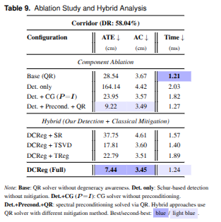
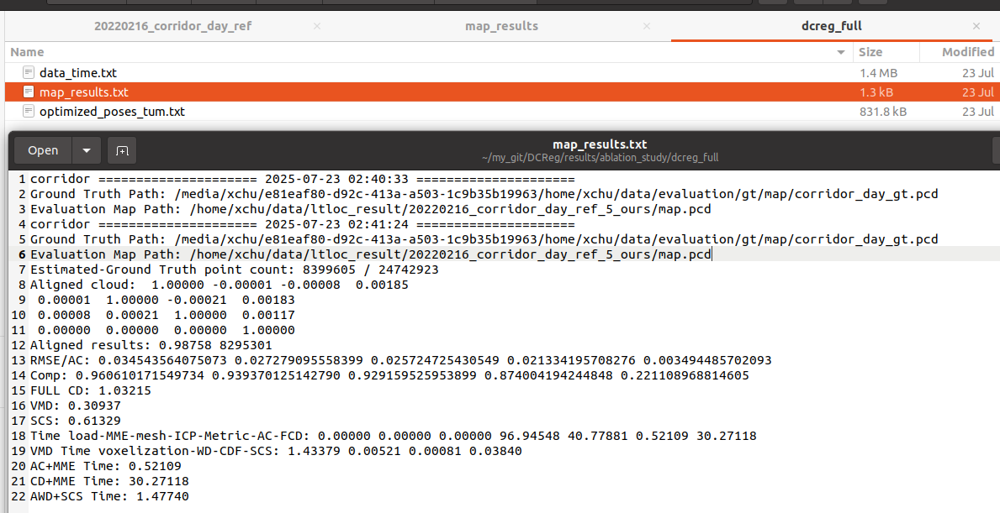
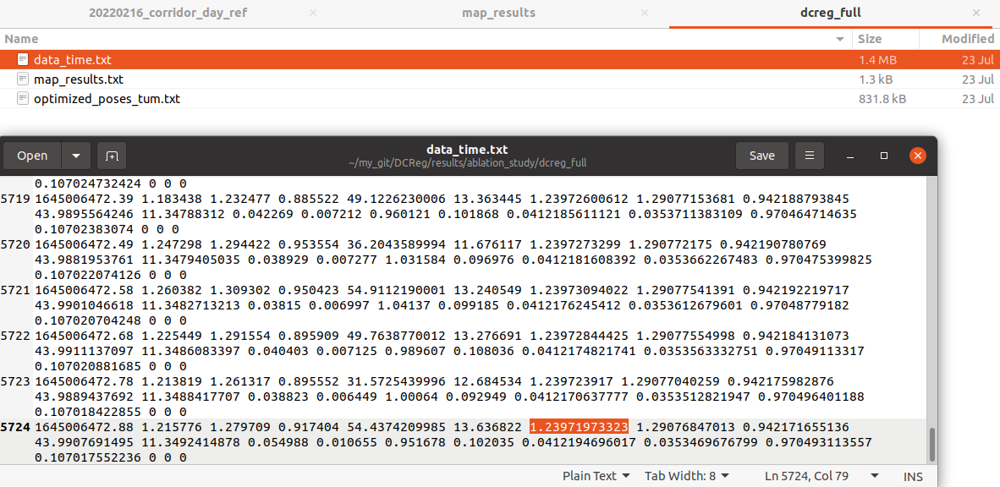

# How to check the results

we provide the detailed experiment results of ablation study here, we can see the tables

In this folder,

- **20220216_corridor_day_fp.txt**: ground truth trajectory in tum format
- **optimized_poses_tum.txt**: the final trajectory generated by each method in tum format

- **map_results.txt:** the map evaluation results by MapEval. we just choose the AC results.

  

- **data_time.txt**: all time cost in this process. we just **see the 7-th value of the last line**, which represents the average map registration time in ms.

