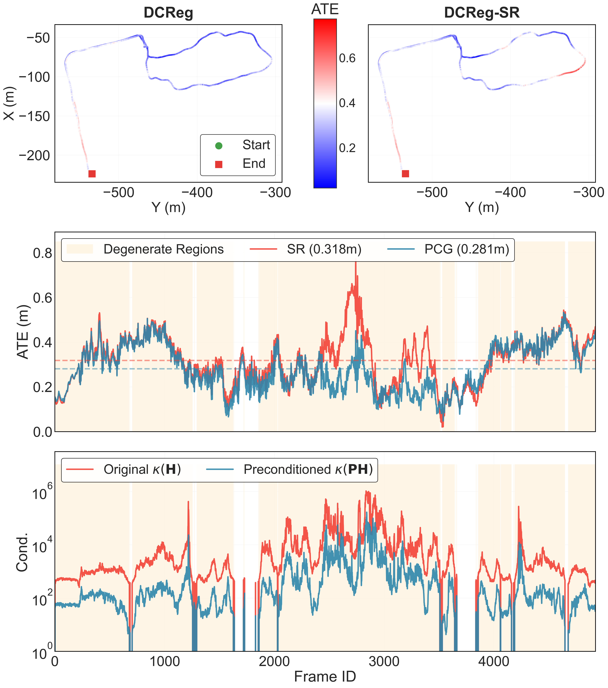

just use the following scripts, you can plot this figures

```python
python3 pcg_visulization_with_traj.py
```

the following files:

- **pcg_ate.zip**: the trajectory error results of DCReg over times generated by evo.
- **qr_ate.zip**: the trajectory error results of DCReg-SR (Det. + QR solver) over times generated by evo.

- pcg.txt: the cond and time cost data in this process.

  ```python
      columns = ['timestamp', 'cond_H', 'cond_PH', 'cond_improvement_ratio',
                 'converged_iterations', 'time_pcg_ms', 'time_qr_direct_ms',
                 'first_iter_residual', 'first_iter_precond_residual', 
                 'first_iter_alpha', 'first_iter_rz_product',
                 'final_residual_pcg', 'final_residual_qr_direct',
                 'solution_diff_norm', 'degenerate_update_ratio',
                 'noise_amplification_factor', 'is_degenerate']
  ```

- **Parkinglot-2023-10-28-18-59-01_0.005_ins_tum.txt**: ground truth trajectory
- **optimized_poses_tum.txt**: the trajectory of DCReg
- **optimized_poses_tum_qr.txt**: the trajectory of DCReg-SR


